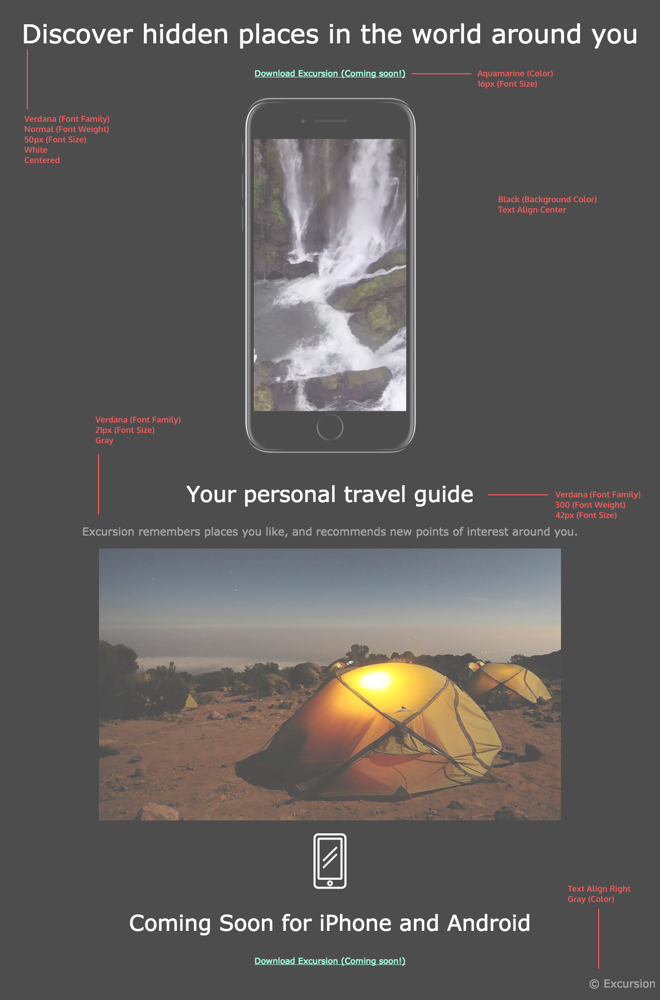

# Excursion_Project

Off the shelf CodeCademy project to practice HTML, CSS, GitHub and publidshing to GitHub pages.

"The web page we’ll build advertises a mobile app which helps users record and share their experiences, so we’ll use video and landscape imagery to set the scene. A landing page is a vital tool in marketing a product these days, and the goal will be to entice potential customers into using the product."

The project in its current state can be viewed at the following URL: <https://wglebster.github.io/Excursion_Project/excursion.html>

## Final thoughts

I completed this project to exact specification outlined in the redline.
If I was to make amendments, I would set sizes in dynamic units instead of px and possibly make some elements larger or smaller.
